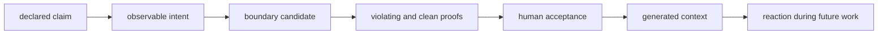

# Tianheng Foundry

Forge declared Rust architecture prose into tested Tianheng reactions.

Tianheng Foundry is a portable skill collection for people adopting
[Tianheng](https://github.com/tacticaldoll/tianheng) in their own Rust projects. It helps an agent
turn an existing architectural claim into candidate boundary code, prove that the boundary reacts,
and present the result for human acceptance.

Foundry does not invent policy. The adopter's constitution remains the source of law.

## The Thesis

Architecture guidance drifts when it exists only as prose. Tianheng makes observable structure
react in code; Foundry supplies the guarded reasoning needed to cross from declared prose to that
reaction:



The generated code is never accepted merely because an agent wrote it or a test passed. Human
review is the authority transition.

## Skills

### `forge-law`

Use when:

- a Rust project already uses Tianheng and contains a declared architecture constraint;
- a user explicitly asks to adopt Tianheng for one declared constraint; or
- an agent is about to add normative architecture prose that could instead become a reaction.

The skill first checks Rust and Tianheng eligibility, then classifies the claim, finds a real
observation source, selects a narrow public Tianheng recipe, writes a candidate, and proves both
teeth and precision.

It declines non-Rust repositories, generic best-practice invention, subjective claims, and
constraints Tianheng cannot observe.

Invoke it explicitly as `$forge-law`, or let a compatible host select it from its description.

### `activate-law`

Use before inspecting or changing code in an already governed Rust workspace. The skill reads the
adopter's canonical law projection, forms a change envelope, and selects direct and adjacent
dependency, semantic, runtime, and workspace boundaries into task-local context.

It is read-only. Uncovered effects remain visible without becoming invented policy, and the
post-change Tianheng reaction remains the binding verification.

Invoke it explicitly as `$activate-law`, or let a compatible host select it before governed Rust
work begins.

### `repair-drift`

Use after an accepted Tianheng boundary reacts to Rust product code. The skill reads the structured
reaction reason-first, freezes the constitution and baseline, repairs the product code, then reruns
the same reaction and repository gates.

It distinguishes enforced drift from warn-only, baselined, and exit-class `2` states. It refuses
allowlist widening, severity reduction, baseline additions, and every other attempt to make the
reaction pass by weakening law.

Invoke it explicitly as `$repair-drift`, or let a compatible host select it from Tianheng check
output.

### `amend-law`

Use only when a user explicitly requests a deliberate change to an existing accepted Tianheng
boundary. The skill snapshots accepted behavior, classifies the change as tighten, loosen,
retarget, reason correction, or removal, and proves the exact before/after reaction delta.

It keeps candidate authority separate from acceptance, exposes observation lost by loosening or
removal, and refuses vague green-CI authority.

Invoke it explicitly as `$amend-law`, or let a compatible host select it from an explicit
amendment request.

### `review-law`

Use when a candidate diff adds or changes Tianheng boundaries, reasons, baselines, proof fixtures,
or generated projection. The skill runs sequential authority, observability, reaction, minimality,
projection, and compatibility gates.

It reports findings first and returns `ACCEPT_CANDIDATE`, `REVISE`, or `REJECT`. Even
`ACCEPT_CANDIDATE` leaves acceptance with the human or steward.

Invoke it explicitly as `$review-law`, or let a compatible host select it from a Tianheng law diff.

### `shape-capability`

Use when an authorized structural Rust claim has no supported Tianheng observation. The skill first
proves the gap is not an overlooked recipe, compatibility mismatch, non-structural preference, or
cross-language concern, then shapes an observation contract and fixture matrix.

It produces upstream-ready capability pressure without writing a no-op adopter boundary or
implementing Tianheng.

Invoke it explicitly as `$shape-capability`, or let a compatible host select it from a reported
capability-pressure stop.

### `manage-baseline`

Use for an explicitly authorized baseline adoption, refresh, stale prune, annotation update, or
retirement. The skill compares structured `(target, rule_key, fact)` identities before every write
and refuses to absorb newly observed drift without separate authority.

It treats a baseline as accepted-current debt that changes gate outcome, not as law or cleanliness.

Invoke it explicitly as `$manage-baseline`, or let a compatible host select it from a baseline or
stale-entry request.

## Design

- **Declared intent only.** Existing project prose or direct human instruction supplies authority.
- **Observation before generation.** No observation source means no boundary.
- **Proof before replacement.** A violating fixture must react and a clean fixture must remain
  clean before prose can be retired.
- **Human authority.** Generated output remains a candidate until reviewed.
- **Forward reasons.** A boundary reason describes the structure the reaction protects, within its
  observable perimeter.
- **Independent repositories.** Foundry references Tianheng's public surface without vendoring it
  or using git submodules.
- **Progressive disclosure.** The skill keeps its control flow compact and opens reference material
  only when the current decision needs it.

## Repository

```text
skills/*/                  skill entrypoints and focused references
tests/scenarios/           authority and eligibility policy cases
tests/repair-scenarios/    reaction routing and law-protection cases
tests/amendment-scenarios/ amendment authority and proof-direction cases
tests/activation-scenarios/ task-local law selection and routing cases
tests/review-scenarios/     adversarial acceptance-gate cases
tests/capability-scenarios/  observation-gap classification and ownership cases
tests/baseline-scenarios/    debt-ratchet authority and identity-diff cases
tests/compatibility/       representative Tianheng consumer fixture
scripts/                   network-free validation entrypoints
docs/                      identity, lifecycle, packaging, and compatibility
tools/th-foundry-cli/      local multi-host deploy CLI (th-foundry)
```

`PROJECT.md` records standing decisions and non-goals. `AGENTS.md` is the authoring contract for
contributors.

## Install

For a local Codex marketplace checkout:

```bash
codex plugin marketplace add /path/to/tianheng-foundry
codex plugin add tianheng-foundry@tianheng-foundry
```

Start a new Codex thread after installing or refreshing the plugin so skill discovery uses the new
version. Claude, Cursor, Gemini, and generic agent distributions use the host manifests already
checked into the repository; see `docs/host-packaging.md`.

To deploy across every local agent host in one step (Claude, Codex, Antigravity, Gemini CLI,
Copilot CLI, Cline, Cursor, OpenCode — whichever are installed on the machine), use the
[`th-foundry` CLI](tools/th-foundry-cli/):

```bash
uv tool install ./tools/th-foundry-cli
th-foundry deploy --all
```

Unlike Fornax's own CLI, `th-foundry` deploys from the local checkout rather than a tagged release
— this project has not cut one yet. See [`tools/th-foundry-cli/README.md`](tools/th-foundry-cli/README.md)
for the distinction and the plain `hosts`/`status`/`doctor` commands.

## Validate

The normal repository gate is:

```bash
python3 scripts/validate_skills.py
python3 scripts/test_scenarios.py
python3 scripts/test_repair_scenarios.py
python3 scripts/test_amendment_scenarios.py
python3 scripts/test_activation_scenarios.py
python3 scripts/test_review_scenarios.py
python3 scripts/test_capability_scenarios.py
python3 scripts/test_baseline_scenarios.py
python3 "${CODEX_HOME:-$HOME/.codex}/skills/.system/skill-creator/scripts/quick_validate.py" \
  skills/forge-law
python3 "${CODEX_HOME:-$HOME/.codex}/skills/.system/plugin-creator/scripts/validate_plugin.py" .
```

`.githooks/pre-commit` runs the network-free part of that gate (the first eight commands)
automatically before every commit, but git does not wire a repository's own hook directory in by
default. Enable it once per clone:

```bash
git config core.hooksPath .githooks
```

Without that step the hook file is inert and only CI catches a violation, after push.

To compile representative generated vocabulary against a local Tianheng checkout:

```bash
TIANHENG_SOURCE=/path/to/tianheng \
  python3 scripts/check_tianheng_compatibility.py
```

All repository and scenario checks are network-free. The compatibility runner uses Cargo offline
after the selected Tianheng checkout has its dependencies available.

`distribution.json`'s `version` field is the single release-version source. Every other manifest
and `scripts/validate_skills.py` check against it; bump it there and nowhere else.

## Status

Experimental `0.1.x`. The collection currently contains `forge-law`, `activate-law`,
`repair-drift`, `amend-law`, `review-law`, `shape-capability`, and `manage-baseline`. Every skill's
`skill.yaml` declares `status: draft` for this release — that is deliberate, not an oversight:
none has yet gone through a documented promotion to `stable`. The initial supported Tianheng line
is `>=0.3.0,<0.4.0`, with `0.3.0` as the checked representative; wider-range coverage is future
work, not claimed here.

What's actually enforced, versus what still relies on a human following AGENTS.md:

- **CI-enforced** (`.github/workflows/validate.yml`, on every push and pull request):
  `scripts/validate_skills.py` (distribution structure, manifest consistency, and the full
  `skill.yaml` schema) and the seven `scripts/test_*_scenarios.py` suites, plus a separate job that
  compiles representative generated vocabulary against a real `tianheng@v0.3.0` checkout.
  `.githooks/pre-commit` runs the same network-free checks locally once a clone enables it with
  `git config core.hooksPath .githooks` (see Validate above) — CI still catches anyone who hasn't.
- **Self-policed** (no script fails if skipped): the `skill-creator`/`plugin-creator`
  `quick_validate.py` and `validate_plugin.py` steps listed above are not wired into CI; and, by
  design, whether a generated `BoundaryCandidate` should become `AcceptedLaw` is a human review
  judgment this repository never automates (see `docs/law-lifecycle.md`).

## License

MIT OR Apache-2.0.
